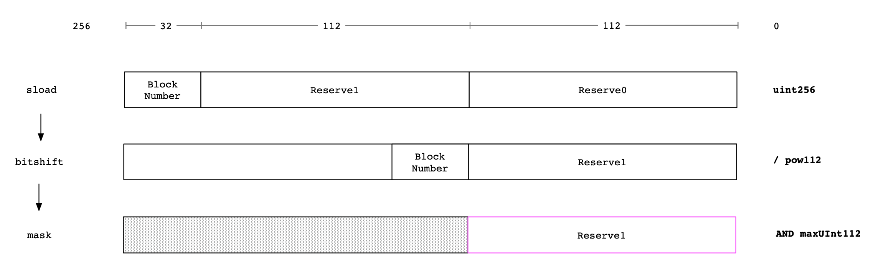
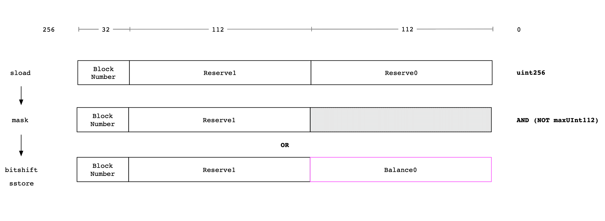

### Constants & Ranges

The `evm-semantics` only defines ranges and constants for a few solidity types. A couple of extra
ones are required for these specs.

#### Powers

```k
syntax Int ::= "pow32"   [function]
rule pow32 => 4294967296 [macro]

syntax Int ::= "pow112"                           [function]
rule pow112 => 5192296858534827628530496329220096 [macro]

syntax Int ::= "pow224"                                                             [function]
rule pow224 => 26959946667150639794667015087019630673637144422540572481103610249216 [macro]
```

#### Limits

```k
syntax Int ::= "maxUInt32"   [function]
rule maxUInt32 => 4294967295 [macro]

syntax Int ::= "maxUInt112"                           [function]
rule maxUInt112 => 5192296858534827628530496329220095 [macro]

syntax Int ::= "maxUInt224"                                                             [function]
rule maxUInt224 => 26959946667150639794667015087019630673637144422540572481103610249215 [macro]
```

#### Inverses

```k
syntax Int ::= "notMaxUInt112"                                                                       [function]
rule notMaxUInt112 => 115792089237316195423570985008687907853269979473343705504629955477416800419840 [macro]

syntax Int ::= "notMaxUInt160"                                                                       [function]
rule notMaxUInt160 => 115792089237316195423570985007226406215939081747436879206741300988257197096960 [macro]

syntax Int ::= "notMaxUInt224"                                                                       [function]
rule notMaxUInt224 => 115792089210356248756420345214020892766250353992003419616917011526809519390720 [macro]
```

#### Ranges

```k
rule #rangeUInt(32, X) => #range(0 <= X <= maxUInt32)   [macro]
rule #rangeUInt(112, X) => #range(0 <= X <= maxUInt112) [macro]
```

### Underflow Checking

Underflow checking as encoded in EVM bytecode by solidity (which knows only 256 bit words), entails
the logical (`Int` based) no-underflow condition on the RHS.

This is required because `K` needs help reasoning its way through the `-Word` operation to simplify
it to match the logical no-underflow constraint expressed within the specs (`iff in range uint256`).

```k
rule A -Word B <=Int A => #rangeUInt(256, A -Int B)
  requires #rangeUInt(256, A) andBool #rangeUInt(256, B)
```

### Bitwise Modulo

The solidity optimizer compiles `block.time % 2**32` into `TIME AND maxUInt32` instead of `TIME
MOD pow32`. `K` is then unable to reason about the size of the result and so cannot apply further
simplifications. We therefore rewrite it back to `modInt pow32`.

```k
rule (maxUInt32 &Int X) => (X modInt pow32)
```

Repeated application of `modInt pow32` can be simplified as follows. This lets us clean the storage
conditions in a few specs.

```k
rule ((X modInt pow32) modInt pow32) => (X modInt pow32)
```

### Commutivity For Bitwise `AND`

`K` doesn't know that bitwise `AND` is commutative, so we give it a little helping hand.

```k
rule (X &Int maxUInt32) => (maxUInt32 &Int X)
rule (X &Int maxUInt112) => (maxUInt112 &Int X)
rule (X &Int maxUInt160) => (maxUInt160 &Int X)
rule (X &Int notMaxUInt224) => (notMaxUInt224 &Int X)
```
### Packed Storage { `uint32` `uint112` `uint112` }

#### Reads

Solidity reads from packed storage locations with the following sequence:

1. `SLOAD` to get the packed word
1. Bitshift the word (e.g. `/Int pow112`)to bring the target of the read to the lower order (rightmost) side
1. Bitwise `AND` with `maxUInt` for the target type to zero out the rest of the word (e.g. `AND maxUInt32` for a `uint32`)

Example: read `Reserve1`



These lemmas define the read operations specific to each packed storage location.

```k
// Reserve0
rule (maxUInt112 &Int ((Z *Int pow224) +Int ((Y *Int pow112) +Int X))) => X
  requires #rangeUInt(112, X)
  andBool #rangeUInt(112, Y)
  andBool #rangeUInt(32, Z)

// Reserve1
rule (maxUInt112 &Int (((Z *Int pow224) +Int ((Y *Int pow112) +Int X)) /Int pow112)) => Y
  requires #rangeUInt(112, X)
  andBool #rangeUInt(112, Y)
  andBool #rangeUInt(32, Z)

// BlockTimestampLast
rule (maxUInt32 &Int (((Z *Int pow224) +Int ((Y *Int pow112) +Int X)) /Int pow224)) => Z
  requires #rangeUInt(112, X)
  andBool #rangeUInt(112, Y)
  andBool #rangeUInt(32, Z)
```

#### Writes

Solidity writes to packed storage locations with the following sequence:

1. `SLOAD` to get the current value of the word to be written
1. Produce a bit mask by bitshifting `maxUInt` for the target type and taking the one's complement (e.g. `NOT (maxUInt32 * pow224)`)
1. `AND` the mask and the current value of storage to zero out the target region of the word
1. Bitshift the new value into place and `OR` with the word produced by the previous step to write the new value to the target region
1. `SSTORE` the new value of the word

Example: write `Balance0` to `Reserve0`



This produces some pretty gnarly expressions, and `K` needs help simplifying them. Note that
multiple lemmas are needed below to match the cases where individual regions within the word are
known to be zero. In this case `K` will simplify the `0` out of the expression, meaning we have
to match on a few different expressions for each write operation.

The ordering of arguments differs between the various cases to match the bytecode produced by
solidity.

##### Write `reserve0`

Mask target range to zero:

```k
// all regions potentially non-zero
rule (notMaxUInt112 &Int ((Z *Int pow224) +Int ((Y *Int pow112) +Int X))) => ((Z *Int pow224) +Int (Y *Int pow112))
  requires #rangeUInt(112, X)
  andBool #rangeUInt(112, Y)
  andBool #rangeUInt(32, Z)

// reserve0 is zero
rule (notMaxUInt112 &Int ((Z *Int pow224) +Int (Y *Int pow112))) => ((Z *Int pow224) +Int (Y *Int pow112))
  requires #rangeUInt(112, Y)
  andBool #rangeUInt(32, Z)

// reserve1 is zero
rule (notMaxUInt112 &Int ((Z *Int pow224) +Int X)) => (Z *Int pow224)
  requires #rangeUInt(112, X)
  andBool #rangeUInt(32, Z)
```

Write new value:

```k
// all regions potentially non-zero OR reserve0 is zero
rule (X |Int ((Z *Int pow224) +Int (Y *Int pow112))) => ((Z *Int pow224) +Int (Y *Int pow112) +Int X)
  requires #rangeUInt(112, X)
  andBool #rangeUInt(112, Y)
  andBool #rangeUInt(32, Z)

// reserve1 is zero
rule (X |Int (Z *Int pow224)) => ((Z *Int pow224) +Int X)
  requires #rangeUInt(112, X)
  andBool #rangeUInt(32, Z)
```

##### Write `reserve1`

Constants:

```k
syntax Int ::= "notMaxUInt112xPow112"                                                                       [function]
rule notMaxUInt112xPow112 => 115792089210356248756420345214020892766250359184300278151744640057305848610815 [macro]
```

Mask target range to zero:

```k
// all regions potentially non-zero
rule (notMaxUInt112xPow112 &Int ((Z *Int pow224) +Int ((Y *Int pow112) +Int X))) => ((Z *Int pow224) +Int X)
  requires #rangeUInt(112, X)
  andBool #rangeUInt(112, Y)
  andBool #rangeUInt(32, Z)

// reserve1 is zero
rule (notMaxUInt112xPow112 &Int ((Z *Int pow224) +Int X)) => ((Z *Int pow224) +Int X)
  requires #rangeUInt(112, X)
  andBool #rangeUInt(32, Z)
```

Write new value:

```k
// all regions potentially non-zero OR reserve1 is zero
rule ((pow112 *Int Y) |Int ((Z *Int pow224) +Int X)) => ((Z *Int pow224) +Int (Y *Int pow112) +Int X)
  requires #rangeUInt(112, X)
  andBool #rangeUInt(112, Y)
  andBool #rangeUInt(32, Z)

// reserve0 is zero
rule ((pow112 *Int Y) |Int (Z *Int pow224)) => ((Z *Int pow224) +Int (Y *Int pow112))
  requires #rangeUInt(112, Y)
  andBool #rangeUInt(32, Z)
```

##### Write `blockTimestampLast`

Mask target range to zero. Note that solidity uses a slightly different approach here than with the
other words, and directly applies a mask of `&Int pow224`, instead of bitshifting and inverting as
for `reserve0` and `reserve1`. This only happens when the optimizer is enabled.

```k
rule (maxUInt224 &Int ((Z *Int pow224) +Int ((Y *Int pow112) +Int X))) => ((Y *Int pow112) +Int X)
requires #rangeUInt(112, X)
  andBool #rangeUInt(112, Y)
  andBool #rangeUInt(32, Z)
```

write new value:

```k
rule ((Z *Int pow224) |Int ((Y *Int pow112) +Int X)) => ((Z *Int pow224) +Int (Y *Int pow112) +Int X)
  requires #rangeUInt(112, X)
  andBool #rangeUInt(112, Y)
  andBool #rangeUInt(32, Z)
```

##### Write `uint160`

Address type storage routine.

When writing addresses to storage, solidity masks the existing value to zero using the address type
one's compliment and inserts the new value with a bitwise OR.

The inclusion of a `rangeUInt` constraint on existing address `A` allows for the `_` (Junk bytes)
expectation in storage specs.

```k
// Overwrite A with B
rule ((notMaxUInt160 &Int A)) |Int B => B
  requires #rangeAddress(B)
  andBool (#rangeAddress(A) orBool #rangeUInt(256, A))

// Commutativity
rule ((A &Int notMaxUInt160)) |Int B => B
  requires #rangeAddress(B)
  andBool (#rangeAddress(A) orBool #rangeUInt(256, A))

rule (B |Int (notMaxUInt160 &Int A)) => B
  requires #rangeAddress(B)
  andBool (#rangeAddress(A) orBool #rangeUInt(256, A))

rule (B |Int (A &Int notMaxUInt160)) => B
  requires #rangeAddress(B)
  andBool (#rangeAddress(A) orBool #rangeUInt(256, A))
```

### Packed Words In Memory

Sometimes solidity will try and read a Word from memory containing unaligned data. In that case `K`
needs help simplifying the resulting expressions:

masking:

```k
// mask first four bytes to zero
rule maxUInt224 &Int #asWord(WS) => #asWord(#padToWidth(32, #drop(4, WS)))
  requires #sizeWordStack(WS) ==Int 32

// mask everything except first four bytes to zero
rule notMaxUInt224 &Int #asWord(WS) => #asWord(#padRightToWidth(32, #take(4, WS)))
  requires #sizeWordStack(WS) ==Int 32
```

writes:

```k
// write first four bytes
rule X |Int #asWord(#padToWidth(32, WS)) => #asWord(#take(4, #asByteStack(X)) ++ WS)
  requires X &Int notMaxUInt224 ==Int X
  andBool #rangeUInt(256, X)
  andBool #sizeWordStack(WS) ==Int 28
```
